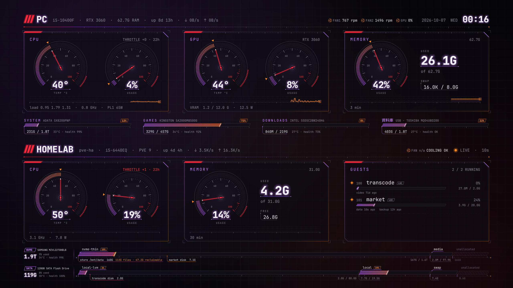
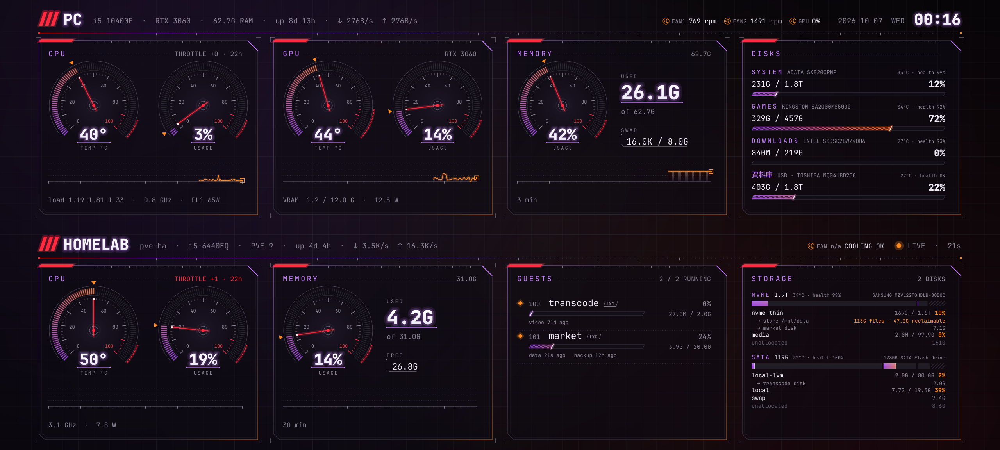
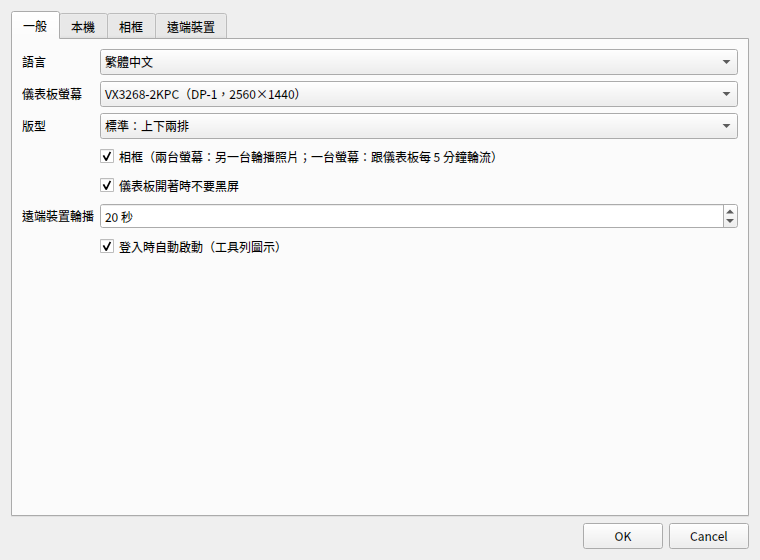
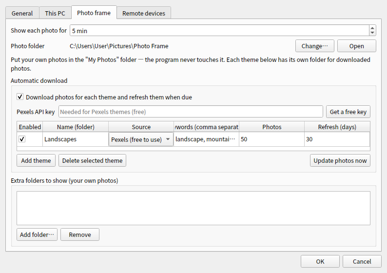
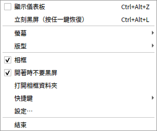
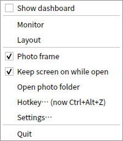

# System Dashboard

全螢幕的系統儀表板（Windows、Linux）：一鍵蓋在螢幕最上層，看 CPU、顯卡、記憶體、硬碟、風扇，以及家裡的伺服器（Proxmox）；
另一台螢幕同時輪播照片。再按一下就收起來，平常不佔資源。

A full-screen system dashboard for Windows and Linux: one click puts it on top of everything — CPU, GPU, memory, disks, fans and
your home server (Proxmox) — while your other monitor shows a photo slideshow. Click again and it is gone.

## 下載 Download

**[⬇ Windows 安裝檔 / Download for Windows](https://github.com/louisliu0426/system-dashboard-releases/releases/latest/download/SystemDashboard-Setup.exe)**
　Windows 10 / 11（64 位元 / 64-bit）

**[⬇ Linux 安裝包 / Download for Linux (.deb)](https://github.com/louisliu0426/system-dashboard-releases/releases/latest/download/system-dashboard_amd64.deb)**
　Ubuntu 22.04+ / Debian 系（GNOME，64 位元 / 64-bit；已在 24.04、26.04 實測 / tested on 24.04 and 26.04）：`sudo apt install ./system-dashboard_amd64.deb`

- 測試版 Beta — 安裝說明 [中文](https://github.com/louisliu0426/system-dashboard-releases/releases/latest/download/INSTALL-zh-TW.txt) ·
  [English](https://github.com/louisliu0426/system-dashboard-releases/releases/latest/download/INSTALL-en.txt)
- 所有版本 All releases: [Releases](https://github.com/louisliu0426/system-dashboard-releases/releases)

## 特色

- **一鍵開關**：左鍵點工具列圖示，或按 `Ctrl+Alt+Z`（可自訂），全螢幕遊戲中也能叫出來
- **碼表式儀表**：CPU／顯卡溫度和使用率、記憶體、網速、風扇轉速、每顆硬碟的用量、溫度和健康度
- **過熱警告**：溫度進紅區、或閒置卻很熱（風扇可能停了）時，錶盤整個變紅
- **相框**：另一台螢幕輪播照片（自己的照片、或自動下載高畫質風景照）；只有一台螢幕時跟儀表板輪流
- **家用伺服器**：Proxmox 的 CPU、記憶體、虛擬機／容器、儲存池，多台輪流顯示（選用）
- **開箱即用**：安裝時一起裝好溫度感測，不用另外裝其他軟體；介面自動中英文
- **省資源**：只重畫有變的部分，打開時約佔單核 3%，收起來幾乎不佔

## Features

- **One click**: left-click the tray icon or press `Ctrl+Alt+Z` (customisable) — works over full-screen games
- **Gauges**: CPU / GPU temperature and load, memory, network, fan speeds, and usage, temperature and health of every disk
- **Overheat warnings**: the gauge turns red in the red zone, or when the machine is idle but hot (a fan may have stopped)
- **Photo frame**: a slideshow on your other monitor (your own photos, or high-quality landscapes downloaded automatically);
  with one monitor it alternates with the dashboard
- **Home server**: CPU, memory, VMs/containers and storage of Proxmox hosts, rotating between several (optional)
- **Ready to use**: temperature sensing is installed with the program — nothing else to install; English and Chinese UI
- **Light**: only redraws what changed — about 3% of one CPU core while open, practically nothing when closed

| | |
|---|---|
|  |  |
|  |  |

## 隱私 Privacy

程式只讀取這台電腦的硬體狀態，不會把資料傳到外面；只有你自己設定時才會連網（下載相框照片、連到你自己的伺服器）。

The program only reads this computer's hardware status and never sends data out. It only goes online for things you set up
yourself (downloading frame photos, connecting to your own servers).

## 回報問題 Feedback

請到 [Issues](https://github.com/louisliu0426/system-dashboard-releases/issues) 回報，附上記錄檔
（Windows：`%LOCALAPPDATA%\SystemDashboard\state\app.log`；Linux：`~/.local/state/system-dashboard/app.log`）。

Please open an [issue](https://github.com/louisliu0426/system-dashboard-releases/issues) and attach the log file
(Windows: `%LOCALAPPDATA%\SystemDashboard\state\app.log`; Linux: `~/.local/state/system-dashboard/app.log`).

---

這個倉庫只放安裝檔，不含原始碼。 This repository only hosts the installer; the source code is not public.
第三方元件授權見安裝資料夾裡的 THIRD-PARTY-NOTICES.txt。 Third-party licenses: THIRD-PARTY-NOTICES.txt in the install folder.

© 2026 holalouisliu.com. All rights reserved.
